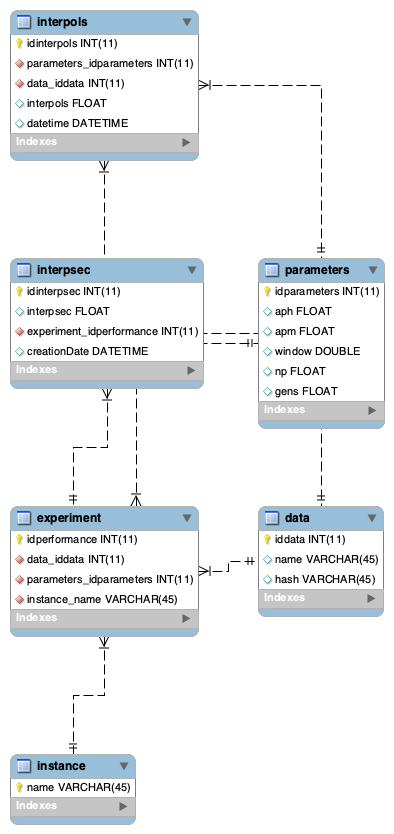

# CloudPITS / Instance Selection

This is the initial idea behind Cloud-PITS, which involves selecting a group of instances that provides a price per 
cost ratio that will execute a given SPITS code in less than an user-defined input amount.
Since this is a prototype it still has a lot of limitations and is not ready for general usage. However the general
idea behind the algorithm is here.

 #### Disclaimer
 
 This is still a proof of concept. The SPITS program used for validation computes the Zero Offset Non-hyperbolic 
 Common Reflection Surface (DOI:10.1111/j.1365-2478.2012.01055.x) parameters, therefore there are some parameters that
  are currenlty tailored for that specific software. This is not yet generic for any SPITS program!
 
 #### How it works
 
 The instance selection algorithm works with a stored database containing previous executions performance 
 measurements. By using previous executions information for the same experiment it is possible to infer how the 
 current experiment will perform, therefore allows us to create a good initial instance poll. Additionally, by 
 verifying periodically how the instances are performing and how expensive they are at a given moment, it is possible
  to select the types that offer better performance for their money.
 
 The three main files are the following (with their input/output described in their own headers):
 
    launch/create_ondemand_jm.py
    populate/simulation.py
    populate/to_execute.py
    
 The first one (launch/create_ondemand_zocrsomp_jm.py) is used to launch an On-Demand instance that should work as 
 the master instance (Job Manager and instance selector). Therefore it is necessary that in some part of the 
 user_data variable inserting the code for calling the "to_execute.py" code to call this instance selection algorithm
 and start the Job Manager process.
 
 The second one simulates an execution, given previous the information stored in the database and the price log 
 stored in a file (populate/log_prices.csv). This allows the user to simulate how much would be spent for each input 
 price.
  
 The last one is the actual Python script to be executed, in which the script will start a new poll of instances and 
 then verify from time to time for instances that are performing below the desired cost vs performance threshold. 
 Replacing bad performing types with better ones. 
 
 #### Database
 
 The algorithm extracts information from a database as configured in the "rds_config.py" file. The database should be
  called "experimentos" and have the tables as displayed in the picture below. There is a SQL script to generate it 
  in the folder "databases/".
 
 
 #### Performance measurement report
 
 The worker instances must report their performance to the Job Manager via CloudWatch. To do so, the user needs to 
 create a new metric with the following characteristics:
    
    Namespace='Performance',
    MetricName='perf_sec',
    Dimensions=[{'Name': 'Instance Id', 'Value': instance_id},
                {'Name': 'Type', 'Value': instance_type}]
                
    Namespace='Performance',
    MetricName='perf_sec_stdev',
    Dimensions=[{'Name': 'Instance Id', 'Value': instance_id},
                {'Name': 'Type', 'Value': instance_type}]
                
    Namespace='Performance',
    MetricName='tasks_completed',
    Dimensions=[{'Name': 'Instance Id', 'Value': instance_id},
                {'Name': 'Type', 'Value': instance_type}]
                
 This report also goes to the database aforementioned so that future executions use them. Also, they are mandatory so
  that the instance selection Python script can select the initial poll of instances for the SPITS program being 
  optimized.
  
 #### Dependencies
 
 The program have a few dependencies. They can be installed using the python pip command:
   
    python3 -m pip install --user -r requirements.txt
    
 Most Python packages already come with the some dependencies installed, however, two of them are not included, namely:
 
    boto3: To access the AWS instances
    pymysql: To enable Python to access a MySQL database and perform queries
  
  Further information about all files are in their own documentations.
